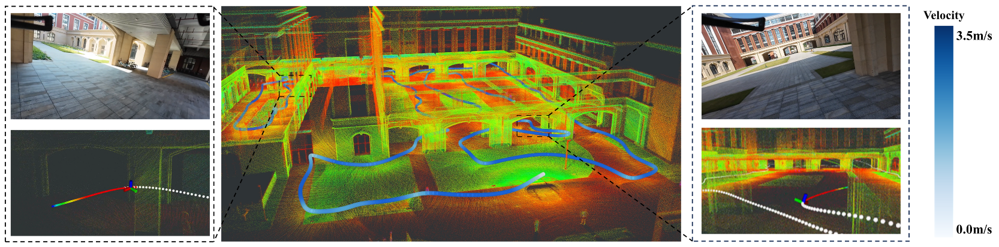

<div align = "center">
  <h1>
    EPIC: Exploring on Point Clouds 
  </h1>
</div>
<div align = "center">
  <h2>
    A Lightweight LiDAR-Based UAV Exploration Framework for Large-Scale Scenarios
  </h2>
</div>
<div align="center">
  <strong>
        Shuang Geng<sup>*</sup>,
        Zelin Ning<sup>*</sup>,
        Fu Zhang, and
        Boyu Zhou<sup>†</sup>
  </strong>
  <p>
    <sup>*</sup>Equal Contribution;&nbsp;
    <sup>†</sup>Corresponding Author
  </p>
  <a href='https://arxiv.org/pdf/2410.14203.pdf'></a>
  <a href="[https://www.bilibili.com/video/BV1Fr421j7oC/?spm_id_from=333.999.0.0&vd_source=0af61c122e5e37c944053b57e313025a](https://www.bilibili.com/video/BV1nrx5eaESY/?spm_id_from=333.1387.homepage.video_card.click&vd_source=07945b0b56417e213633c9332f4f4716)"></a>
</div>

## 💡 News
* **[2025.03.12]** The source code of **EPIC** is released !
* **[2025.03.08]** **EPIC** is accepted by RAL 2025 🚀 !

## 📜 Introduction

**EPIC** (**E**xploring on **P**o**I**nt **C**louds) is a lightweight LiDAR-based UAV exploration framework that directly exploits point cloud data to explore large-scale environments. Experimental results demonstrate that our framework achieves faster exploration while significantly reducing memory consumption. (Click the image to view the video)

[](https://www.bilibili.com/video/BV1nrx5eaESY/?spm_id_from=333.1387.homepage.video_card.click&vd_source=07945b0b56417e213633c9332f4f4716)

Please cite our paper if you use this project in your research:

```
@article{geng2024epic,
  title={EPIC: A Lightweight LiDAR-Based UAV Exploration Framework for Large-Scale Scenarios},
  author={Geng, Shuang and Ning, Zelin and Zhang, Fu and Zhou, Boyu},
  journal={arXiv preprint arXiv:2410.14203},
  year={2024}
}
```
Please kindly star ⭐️ this project if it helps you. We take great efforts to develop and maintain it 😁.

## 🛠️ Installation

### Test Environment
* Ubuntu 20.04
* ROS Noetic
* C++17

### 🚀 Quick Start

#### Clone our repository and build
```bash
git clone https://github.com/SYSU-STAR/EPIC.git
catkin build
```
#### Download dataset 
Download simulation maps from my [Google cloud](https://drive.google.com/drive/folders/1tuoVo8PL1m2cmmufkHpu4e7hK36WhJs3?usp=drive_link), move them to `MARSIM/map_generator/resource`.

#### Run program 
```bash
source ./devel/setup.zsh && roslaunch epic_planner garage.launch
```
You can replace `garage` with other maps. We provide three test scenarios: `garage`, `cave` and `factory`.

Our simulation environment is developed based on the GPU version of MARSIM. So if you don't have a GPU, you may need to make some necessary modifications to the simulator.


## 🤓 Acknowledgments

We would like to express our gratitude to the following projects, which have provided significant support and inspiration for our work:
- [GCOPTER](https://github.com/ZJU-FAST-Lab/GCOPTER): A general-purpose trajectory optimizer for multicopters, our local planner is based on it.
- [FUEL](https://github.com/HKUST-Aerial-Robotics/FUEL): An efficient framework for fast UAV exploration from which our global planner draws inspiration.
- [MARSIM](https://github.com/hku-mars/MARSIM): A lightweight point-realistic simulator for LiDAR-based UAVs upon which our simulator is built.

